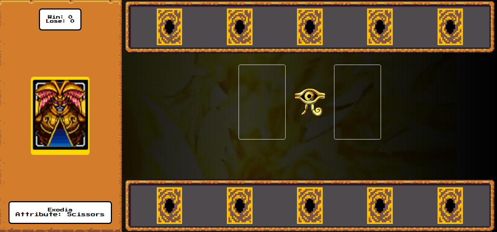

# Yu-Gi-Oh | Jo-ken-po Edition

Jogo de Jokenpo com temática de Yu-Gi-Oh criado durante o módulo de javascript avançado do Bootcamp Santander Front-End 2025. Para o visual foram usados alguns recursos do framework [RPGUI](https://github.com/RonenNess/RPGUI).

conceitos abordados:
- Armazenamento e gerenciamento de estado manual
- Funções limpas
- Organização de código

[Jogo funcionando](https://tanizmoura.github.io/yugioh-jokenpo/)
